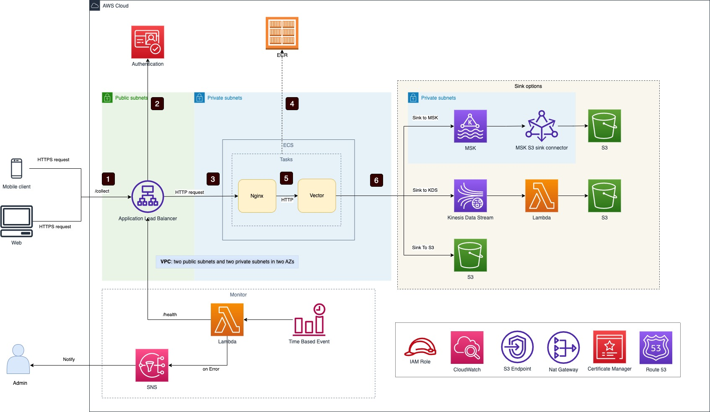

# Data Ingestion Solution Server Side - nginx + vetor
The repository hosts a temporary version the data ingestion solution using Nginx and Vector. Please be aware of it is a beta version. Use it on your own risk.

## Architecture



1. Requests are sent by web or mobile clients to AWS application load balancer
2. (Optional) AWS application load balancer verifies client token
3. AWS application load balancer forwards requests to Nginx endpoint in ECS service
4. ECS service loads Nginx and Vector images from ECS and start them within an ECS task (only one time during deployment)
5. Nginx server forwards requests to Vector server via HTTP
6. Vector server sinks data to MSK, Kinesis Stream or S3 based on configuration

## How to deploy

### Prerequisites

1. Follow this [doc](https://docs.aws.amazon.com/cdk/v2/guide/getting_started.html) to setup AWS CDK
2. Install Docker in your machine
3. Run below commands to install npm packages 

```sh
cd src
npm install
```

### Deploy


1. Deploy VPC, Kinesis Data Stream and ingestion server separately

```sh
cd src

# create a new VPC
cdk deploy clickstream-vpc 

# create infra, such as S3 bucket
cdk deploy clickstream-infra

# create a new Kinesis stream
cdk deploy cs-kinesis-small

# deploy the ingestion server
cdk deploy cs-server-kinesis-ec2-vector

```

## Q&A

1. How to change server(ALB) endpoint path and port?

   The default path is `/collect`, you can config it by changing function `serverEndpointPath()` in `src/lib/config.ts`

   The default port is `80`, you can config it by changing function `serverEndpointPort()` in `src/lib/config.ts`

2. How to configure Kinesis Data Stream
   
   Change return value of below functions in `src/lib/config.ts`
   - getKinesisSetting()

3. How to custom EC2 autoscaling group?
    
    Change return value of below functions in `src/lib/config.ts`
    - getEcsEc2NginxAndVectorAsgSetting()
   
4. How to change AZs of ingestion server and ALB(application load balancer)? 
    
    Change return value of below functions in `src/lib/vpc.ts`
    - getAppAZs()  // AZs of ingestion server
    - getALBAZs()   // AZs of application load balancer

5. Can I deploy the solution in a VPC which only has two public subnets? 
   
   Yes. The solution will try to find private subnets with egress in your VPC, if not found, it will be deployed in public subnets.

6. Can I deploy the solution in a VPC which only has one public subnet?
   
   No. At lease two AZs required for ALB(application load balancer).

7. Can I deploy the ingestion server in only one subnet?
   
   Yes. By default, the ingestion server will be deployed in two subnets, you can change `getAppAZs()` in `src/lib/vpc.ts` to one AZ.

8. Can I deploy the ingestion server in only one subnet and ALB(application load balancer) in two subnets?
   
   Yes.


